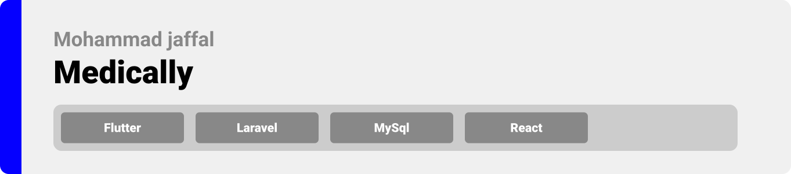

<div align="center">

> Hello world! This is the project’s summary that describes the project plain and simple, limited to the space available. 


**[PROJECT PHILOSOPHY](https://github.com/julescript/well_app#-project-philosophy) • [WIREFRAMES](https://github.com/julescript/well_app#-wireframes) • [TECH STACK](https://github.com/julescript/well_app#-tech-stack) • [IMPLEMENTATION](https://github.com/julescript/well_app#-impplementation) • [HOW TO RUN?](https://github.com/julescript/well_app#-how-to-run)**

</div>

<br><br>


> Medically is a mobile application that allows users to reach out to registered doctors on the platform, place a paid call, rate, review, and add them to their favorites list.

### User Stories
- As a user, I want to consult a doctor for urgent issue without waiting for an appointment
- As a user, I want to share my experience with the doctor I called
<!-- - As a doctor, I want to get paid for my consultations -->

<br><br>


> This design was planned before on paper, then moved to Figma app for the fine details.
Note that i didn't use any styling library or theme, all from scratch

| Landing  | Home/Search  |
| -----------------| -----|
|  |  |

| Artists results  | Artist's Albums  |
| -----------------| -----|
|  |  |


<br><br>


Here's a brief high-level overview of the tech stack the Well app uses:

- This project uses the [Flutter app development framework](https://flutter.dev/). Flutter is an open source framework by Google for building beautiful, natively compiled, multi-platform applications from a single codebase.
- For persistent storage (database), the app uses [MySQL](https://www.mysql.com/) database.
- For the video call system, the app uses the [agora_uikit](https://pub.dev/packages/agora_uikit) package.
- The app uses the font ["Roboto"](https://fonts.google.com/specimen/Roboto) as its main font, and the design of the app adheres to the material design guidelines.


<br><br>


| Landing  | Home/Search  |
| -----------------| -----|
|  |  |


<br><br>


### Prerequisites

* Android Studio
* 2 Android emulators

### Installation

1. Clone the repo
   ```sh
   git clone https://github.com/mohammad-jaffal/medically-project.git
   ```
2. Install packages for react project
   ```sh
   npm install
   ```
3. Install packages for flutter project
   ```sh
   flutter pub get
   ```


