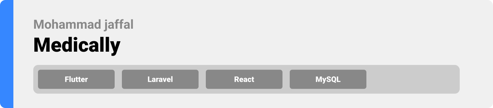
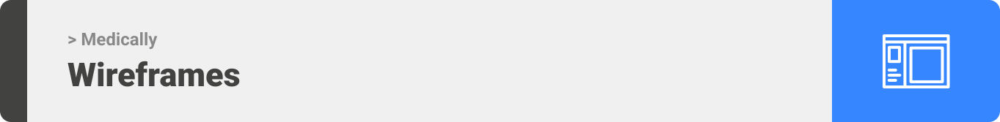
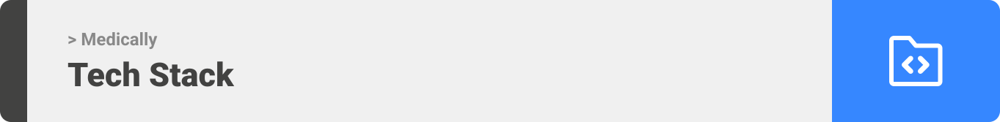
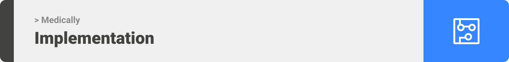
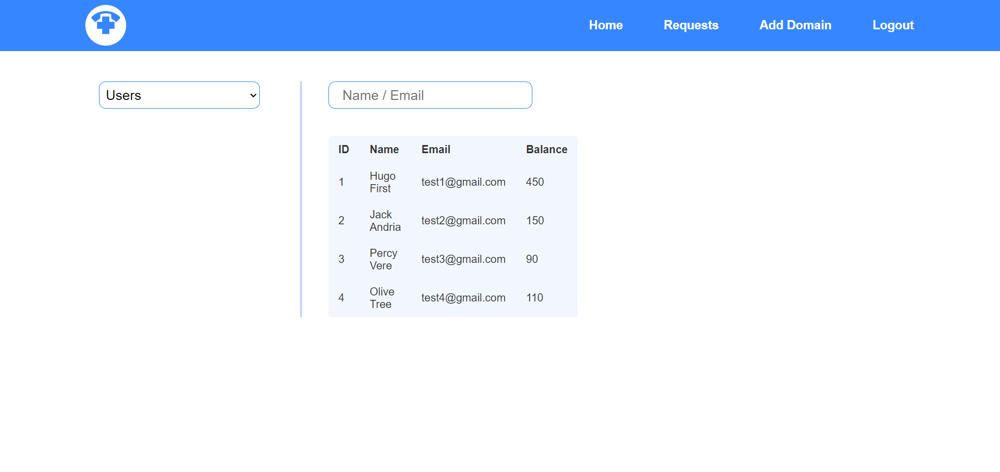
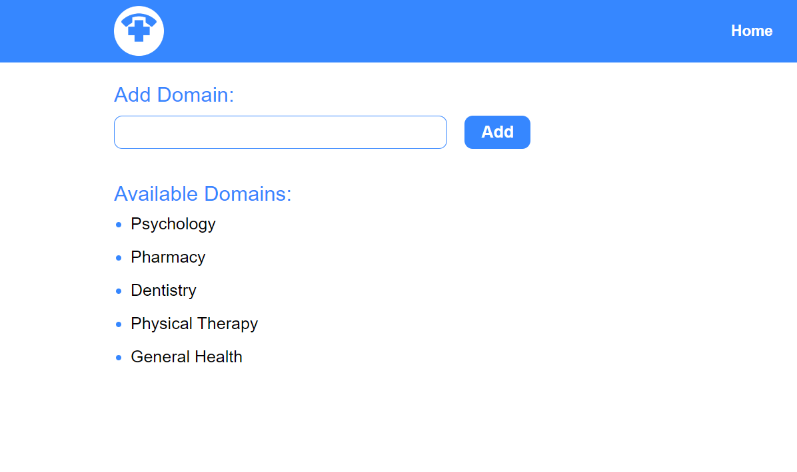
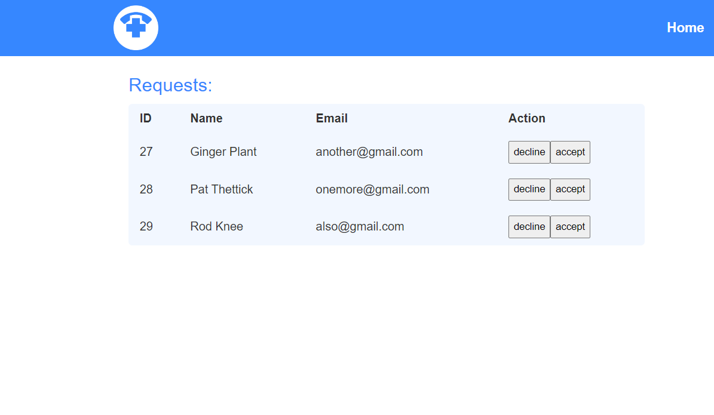

<div align="center">

> Hello world! This is the project’s summary that describes the project plain and simple, limited to the space available. 


**[PROJECT PHILOSOPHY](#project_philosophy) • [WIREFRAMES](#wireframes) • [TECH STACK](#tech_stack) • [IMPLEMENTATION](#implementation) • [HOW TO RUN?](#how_to_run)**

</div>

<br><br>


> Medically is a mobile application that allows users to reach out to registered doctors on the platform, place a paid call, rate, review, and add them to their favorites list.

<br>

### User Stories
- As a user, I want to consult an admin for urgent issue without waiting for an appointment.
- As a user, I want to share my experience with the doctor I called.

<br>

### Doctor Stories
- As a doctor, I want to answer or decline incoming calls.
- As a doctor, I want to be able to go online or offline.
- As a doctor, I want to get a revenue from answering to patients calls.

<br>

### Admin Stories
- As an admin, I want to accept or decline requested doctors.
- As an admin, I want to add new domains.
- As an admin, I want to track the stats of all users and doctors.

<br><br>

<div align="center">

**[PROJECT PHILOSOPHY](#project_philosophy) • [WIREFRAMES](#wireframes) • [TECH STACK](#tech_stack) • [IMPLEMENTATION](#implementation) • [HOW TO RUN?](#how_to_run)• [BACK TO TOP](#top)**

</div>

<br><br>



> This design was planned before on paper, then moved to Figma app for the fine details.
Note that I didn't use any styling library or theme, all from scratch.

<br>

| Login                                 | Sign up                                | User - Home                               | User - Favorites                              |
| ------------------------------------- | -------------------------------------- | ----------------------------------------- | --------------------------------------------- |
|  |  |  |  |

| User - Logs                                | User - Profile                               | User - Doctor Info                         | Doctor - Reviews                               |
| ------------------------------------------ | -------------------------------------------- | ------------------------------------------ | ---------------------------------------------- |
|   |  |  |  |

<div align="center">

| Doctor - Logs                               | Doctor - Profile                               |
| ------------------------------------------- | ---------------------------------------------- |
|  |  |

</div>

<br><br>

<div align="center">

**[PROJECT PHILOSOPHY](#project_philosophy) • [WIREFRAMES](#wireframes) • [TECH STACK](#tech_stack) • [IMPLEMENTATION](#implementation) • [HOW TO RUN?](#how_to_run)• [BACK TO TOP](#top)**

</div>

<br><br>



>Here's a brief high-level overview of the tech stack the app uses:

<br>

- This project uses the [Flutter app development framework](https://flutter.dev/). Flutter is an open source framework by Google for building beautiful, natively compiled, multi-platform applications from a single codebase.
- For the backend, the app uses [Laravel](https://laravel.com/) framework. Laravel is a free and open-source PHP web framework, intended for the development of web applications following the model–view–controller architectural pattern and based on Symfony.
- For persistent storage (database), the app uses [MySQL](https://www.mysql.com/) database.
- For the video call system, the app uses the [agora_uikit](https://pub.dev/packages/agora_uikit) package.
- The app uses the font [Roboto](https://fonts.google.com/specimen/Roboto) as its main font, and the design of the app adheres to the material design guidelines.


<br><br>

<div align="center">

**[PROJECT PHILOSOPHY](#project_philosophy) • [WIREFRAMES](#wireframes) • [TECH STACK](#tech_stack) • [IMPLEMENTATION](#implementation) • [HOW TO RUN?](#how_to_run)• [BACK TO TOP](#top)**

</div>

<br><br>



<br>

* User Screens

| Login                                  | Home                                         | Navigation                                | Filter                                     |
| -------------------------------------- | -------------------------------------------- | ----------------------------------------- | ------------------------------------------ |
|    |    |  |  |

| Add Balance                                  | Update Image                                  | Review                                | Favoriting                                |
| -------------------------------------------- | --------------------------------------------- | ------------------------------------- | ----------------------------------------- |
|    |    |  |  |


<br>

* Dark Mode


<p align="center">

</p>

| Home                                   | Favorites                                   | Logs                                   | Profile                                   |
| -------------------------------------- | ------------------------------------------- | -------------------------------------- | ----------------------------------------- |
|  |  |  |  |

| Balance                                   | Doctor Info                                  |
| ----------------------------------------- | -------------------------------------------- |
|  |  |

<br>

* Doctor Screens


| Profile                                       | Reviews                                         | Logs                                         | Edit                                       |
| --------------------------------------------- | ----------------------------------------------- | -------------------------------------------- | ------------------------------------------ |
|  |  |  |  |

<br>

* Call System


| Calling                                | Video Call                                       | Ringing                                |
| -------------------------------------- | ------------------------------------------------ | -------------------------------------- |
|  |  |  |


| Call Responses                             |
| ------------------------------------------ |
|  |

<br>

* Admin Panel

| Doctors Data                                   |
| ---------------------------------------------- |
| <div align="center">  </div> |

| Users Data                                   |
| -------------------------------------------- |
| <div align="center">  </div> |

<div align="center">

| Hamburger Menu                                                    |
| ----------------------------------------------------------------- |
|  |

</div>

| Add Domain                                        | Requests                                        |
| ------------------------------------------------- | ----------------------------------------------- |
|  |  |

<div align="center">

| Accept Request                              |
| ------------------------------------------- |
|  |

</div> 

<br><br>

<div align="center">

**[PROJECT PHILOSOPHY](#project_philosophy) • [WIREFRAMES](#wireframes) • [TECH STACK](#tech_stack) • [IMPLEMENTATION](#implementation) • [HOW TO RUN?](#how_to_run)• [BACK TO TOP](#top)**

</div>

<br><br>


### Prerequisites

* Flutter
* Android Studio
* Agora account
* 2 Android emulators

### Installation

1. Clone the repo
   ```sh
   git clone https://github.com/mohammad-jaffal/medically-project.git
   ```
2. Install packages for the React project
   ```sh
   npm install
   ```
3. Install packages for the Flutter project
   ```sh
   flutter pub get
   ```
4. Start backend server in cmd
   ```sh
   php artisan serve
   ```
5. Create agora project on the [agora](https://console.agora.io/) console and update app id in flutter project, then generate access token for each accepted doctor


<br><br>

<div align="center">

**[PROJECT PHILOSOPHY](#project_philosophy) • [WIREFRAMES](#wireframes) • [TECH STACK](#tech_stack) • [IMPLEMENTATION](#implementation) • [HOW TO RUN?](#how_to_run)• [BACK TO TOP](#top)**

</div>

<br><br>
