<div align="center">

> Hello world! This is the project’s summary that describes the project plain and simple, limited to the space available. 


**[PROJECT PHILOSOPHY]() • [WIREFRAMES]() • [TECH STACK]() • [IMPLEMENTATION]() • [HOW TO RUN?]()**

</div>

<br><br>


> Medically is a mobile application that allows users to reach out to registered doctors on the platform, place a paid call, rate, review, and add them to their favorites list.

### User Stories
- As a user, I want to consult a doctor for urgent issue without waiting for an appointment
- As a user, I want to share my experience with the doctor I called
<!-- - As a doctor, I want to get paid for my consultations -->

<br><br>


> This design was planned before on paper, then moved to Figma app for the fine details.
Note that I didn't use any styling library or theme, all from scratch

| Login                                 | Sign up                                | User - Home                               | User - Favorites                              |
| ------------------------------------- | -------------------------------------- | ----------------------------------------- | --------------------------------------------- |
|  |  |  |  |

| User - Logs                                | User - Profile                               | User - Doctor Info                         | Doctor - Reviews                               |
| ------------------------------------------ | -------------------------------------------- | ------------------------------------------ | ---------------------------------------------- |
|   |  |  |  |

| Doctor - Logs                               | Doctor - Profile                               |
| ------------------------------------------- | ---------------------------------------------- |
|  |  |

<br><br>


Here's a brief high-level overview of the tech stack the app uses:

- This project uses the [Flutter app development framework](https://flutter.dev/). Flutter is an open source framework by Google for building beautiful, natively compiled, multi-platform applications from a single codebase.
- For persistent storage (database), the app uses [MySQL](https://www.mysql.com/) database.
- For the video call system, the app uses the [agora_uikit](https://pub.dev/packages/agora_uikit) package.
- The app uses the font ["Roboto"](https://fonts.google.com/specimen/Roboto) as its main font, and the design of the app adheres to the material design guidelines.


<br><br>


| Login                                  | Sign up                                 | User - Home                           | User - Favorites                           |
| -------------------------------------- | --------------------------------------- | ------------------------------------- | ------------------------------------------ |
| 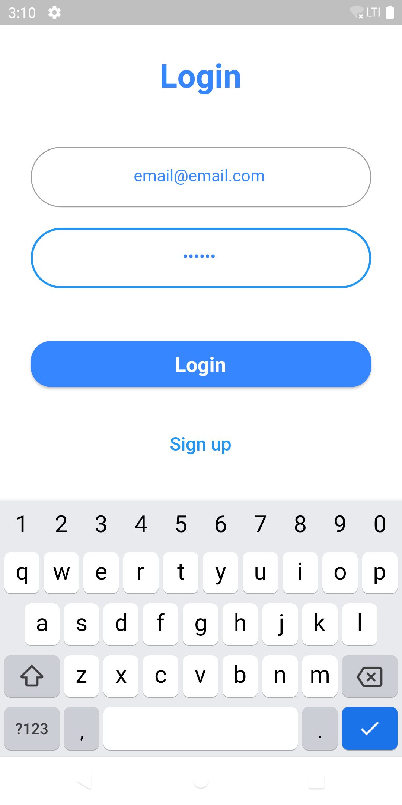 | 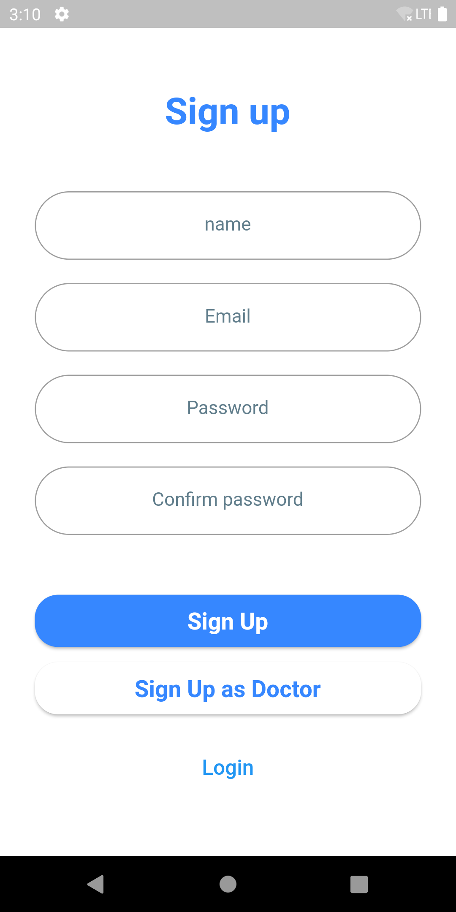 | 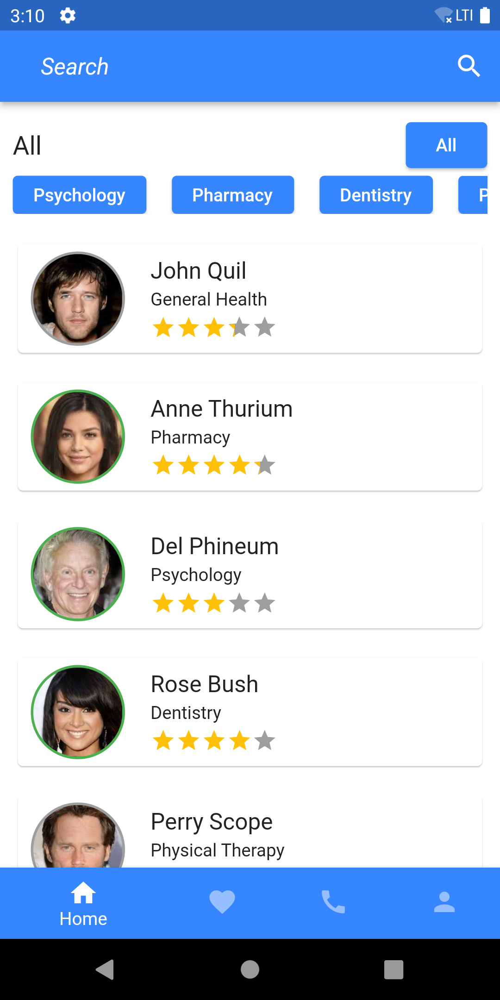 | 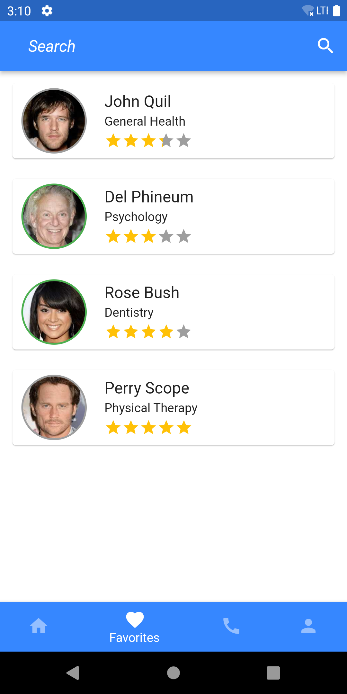 |

| User - Logs                           | User - Profile                           | User - Doctor Info                          | User - Balance                           |
| ------------------------------------- | ---------------------------------------- | ------------------------------------------- | ---------------------------------------- |
| 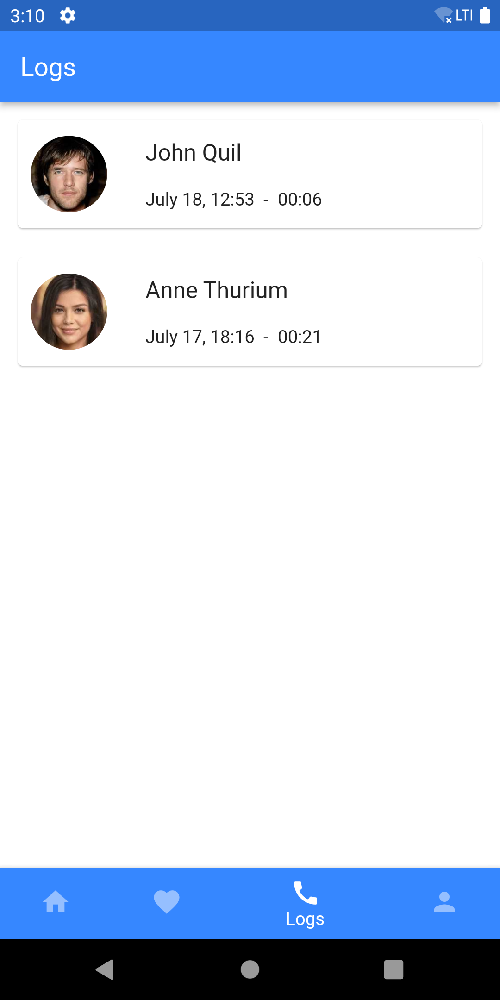 | 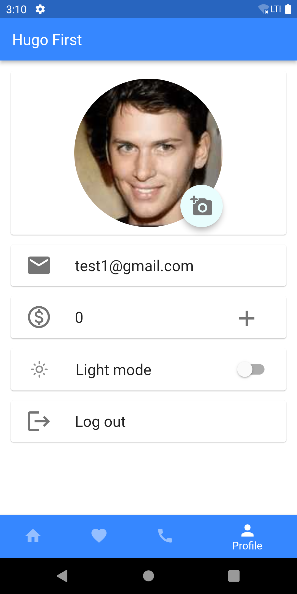 | 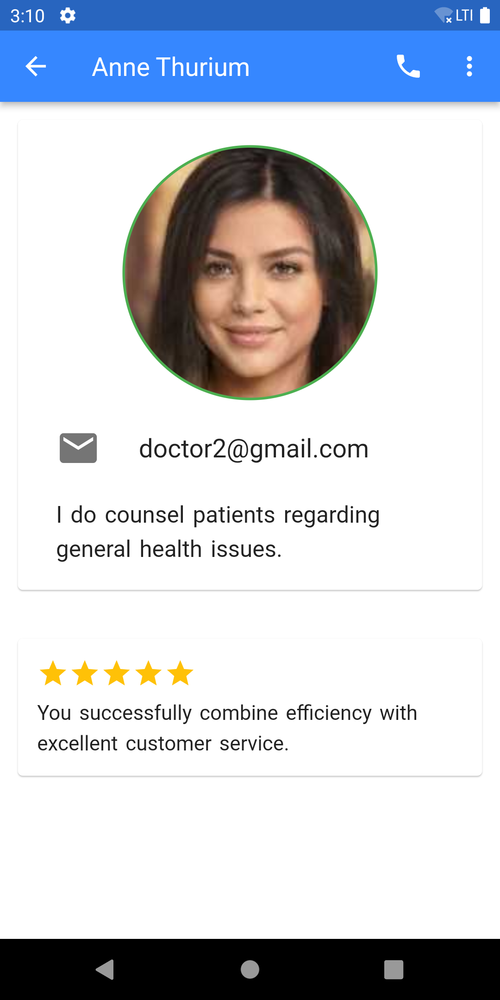 | 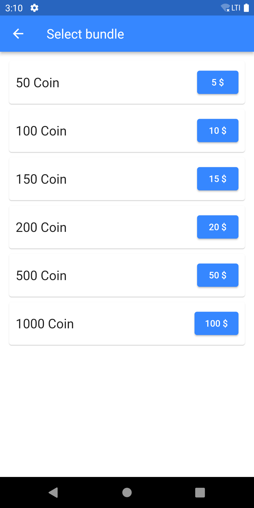 |


| Doctor - Reviews                                | Doctor - Logs                                | Doctor - Profile                                |
| ----------------------------------------------- | -------------------------------------------- | ----------------------------------------------- |
|  |  | 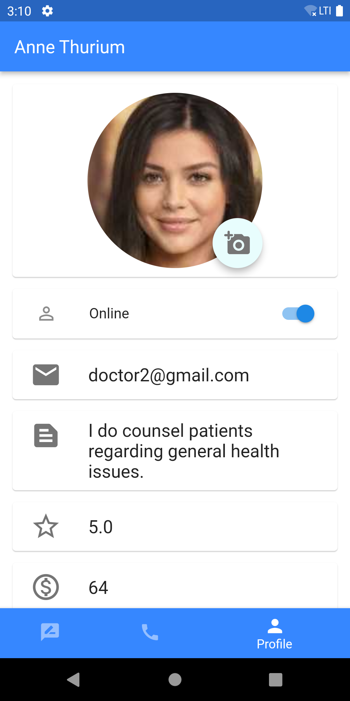 |

| User - Calling                           | Video Call                                                    | Doctor - Ringing                         |
| ---------------------------------------- | ------------------------------------------------------------- | ---------------------------------------- |
| 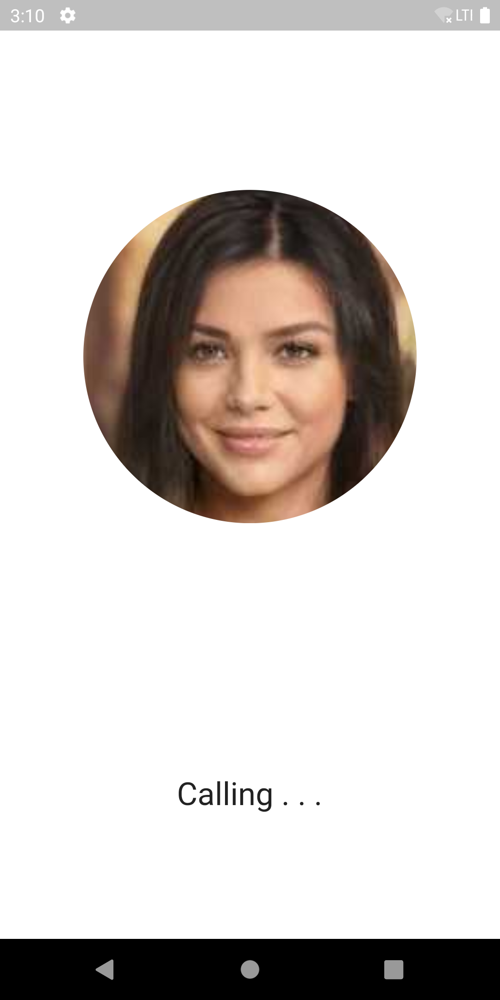 |  |  |


| Call Responses                             |
| ------------------------------------------ |
|  |

> The App is also available in dark mode.

| User - Home                            | User - Favorites                            | User - Logs                            | User - Profile                            |
| -------------------------------------- | ------------------------------------------- | -------------------------------------- | ----------------------------------------- |
|  |  |  |  |

> Admin panel.

| Admin - Doctors Data                           |
| ---------------------------------------------- |
| 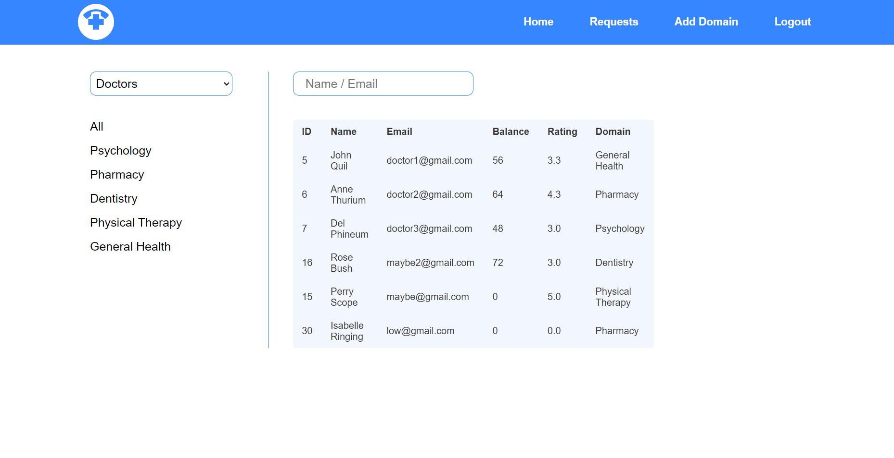 |

| Admin - Users Data                           |
| -------------------------------------------- |
|  |

| Admin - Hamburger Menu                                |
| ----------------------------------------------------- |
|  |

| Admin - Add Domain                                |
| ------------------------------------------------- |
|  |

| Admin - Requests                                |
| ----------------------------------------------- |
|  |

| Admin - Accept Request                        |
| --------------------------------------------- |
| 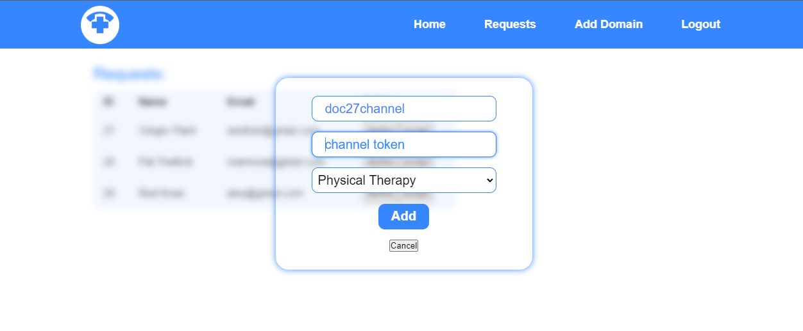 |


<br><br>


### Prerequisites

* Android Studio
* 2 Android emulators

### Installation

1. Clone the repo
   ```sh
   git clone https://github.com/mohammad-jaffal/medically-project.git
   ```
2. Install packages for the React project
   ```sh
   npm install
   ```
3. Install packages for the Flutter project
   ```sh
   flutter pub get
   ```


